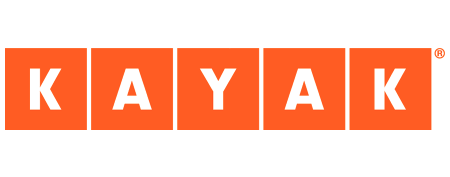

# Plan your trip with Kayak ✈️

## Description

[Kayak](https://www.kayak.com) is a travel search engine that helps user plan their next trip at the best price.

The company was founded in 2004 by Steve Hafner & Paul M. English. After a few rounds of fundraising, Kayak was acquired by [Booking Holdings](https://www.bookingholdings.com) which now holds : [Booking.com](https://booking.com), [Kayak](https://www.kayak.com), [Priceline](https://www.priceline.com), [Agoda](https://www.agoda.com), [RentalCars](https://Rentalcars.com) and [OpenTable](https://www.opentable.com).

With over $300 million revenue a year, Kayak operates in almost all countries and all languages to help their users book travels accros the globe.

The marketing team needs help on a new project. After doing some user research, the team discovered that **70% of their users who are planning a trip would like to have more information about the destination they are going to**. 

In addition, user research shows that **people tend to be defiant about the information they are reading if they don't know the brand** which produced the content. 

Therefore, Kayak Marketing Team would like to create an application that will recommend where people should plan their next holidays. The application should be based on real data about:

* Weather 
* Hotels in the area 

The application should then be able to recommend the best destinations and hotels based on the above variables at any given time.

## Notebooks

| Name | Description |
|:-|:-|
| <ins>_00_project.ipynb_</ins> | Fetch GPS coordinates/weather, scrape Bookings, upload data on S3/RDS and Data Visualization |
| <ins>_01_scraper_test.ipynb_</ins> | Scraper testing |

## Sources

| Name | Description |
|:-|:-|
| <ins>_00_scraper.py_</ins> | Scrapy spider |
| <ins>_01_path.txt_</ins> | Path of the various elements at the time of the project |

## Authors

[Maxime RENAULT](https://github.com/qxzjy)