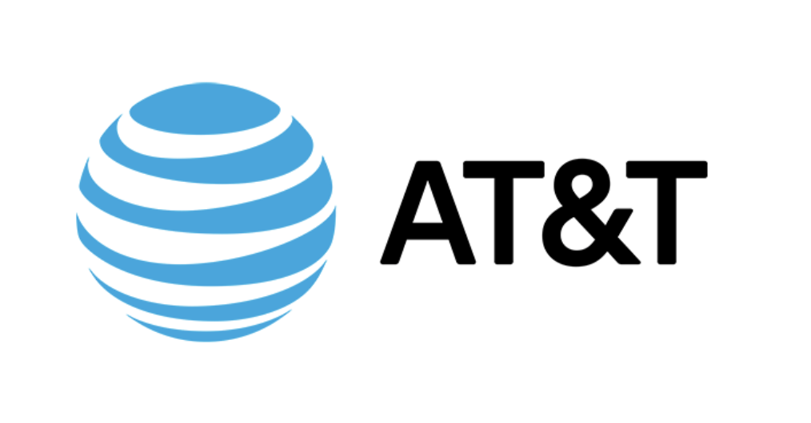

# AT&T Spam Detector 🕵️‍♀️

## Description

[AT&T Inc.](https://www.att.com/) is an American multinational telecommunications holding company headquartered at Whitacre Tower in Downtown Dallas, Texas. It is the world's largest telecommunications company by revenue and the third largest provider of mobile telephone services in the U.S. As of 2022, AT&T was ranked 13th on the Fortune 500 rankings of the largest United States corporations, with revenues of $168.8 billion.

One of the main pain point that AT&T users are facing is constant exposure to SPAM messages. AT&T has been able to manually flag spam messages for a time, but they are looking for an automated way of detecting spams to protect their users.

Our goal is to build a spam detector, that can automatically flag spams as they come based solely on the sms' content.

## Notebooks

| Name | Description |
|:-|:-|
| <ins>_00_project.ipynb_</ins> | Preprocessing (encoding), NN and NN from Transformer |

## Authors

[Maxime RENAULT](https://github.com/qxzjy)